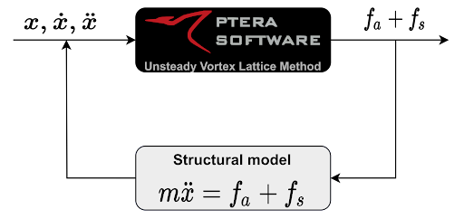
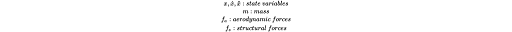
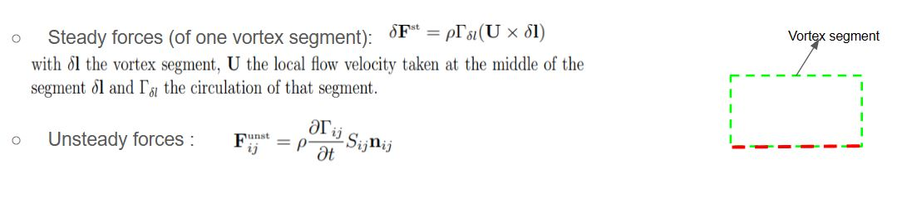
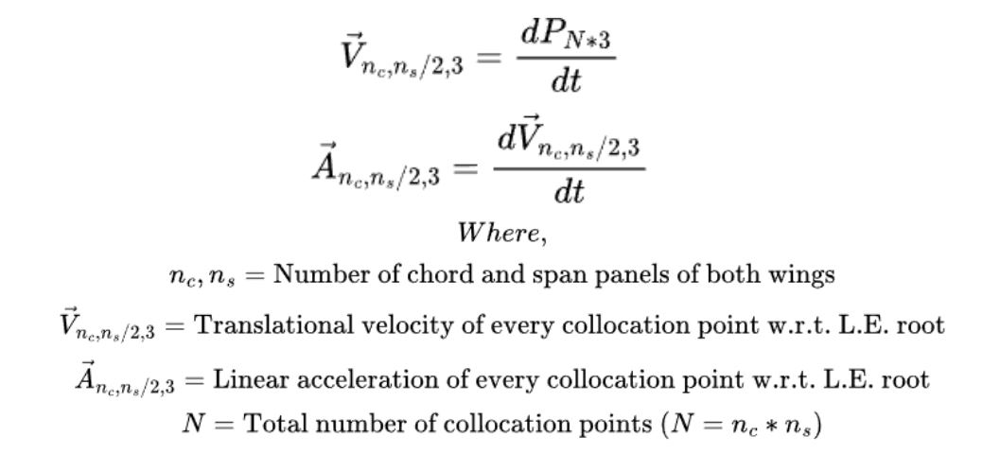
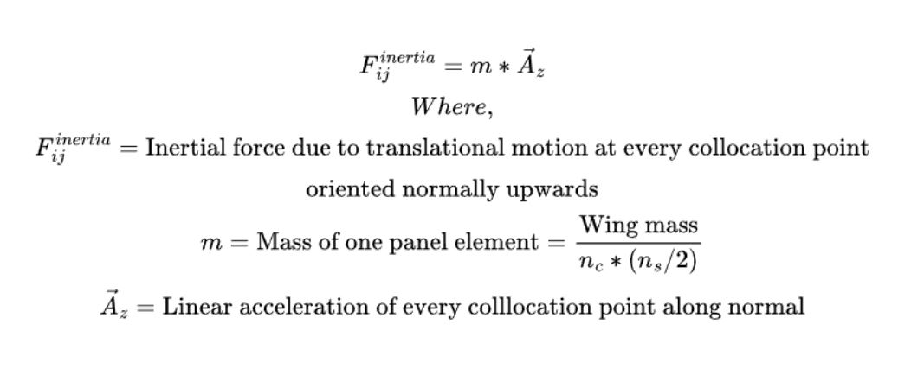
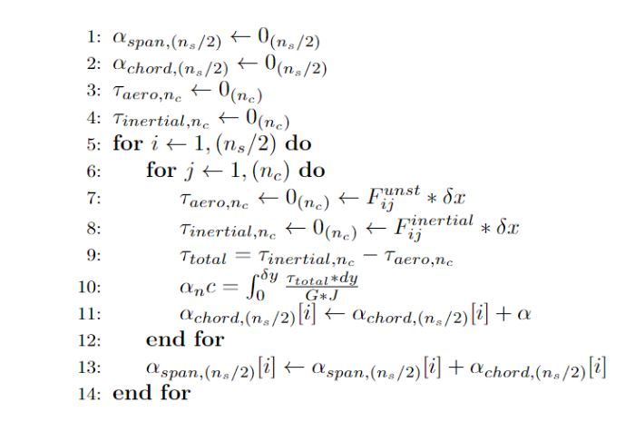
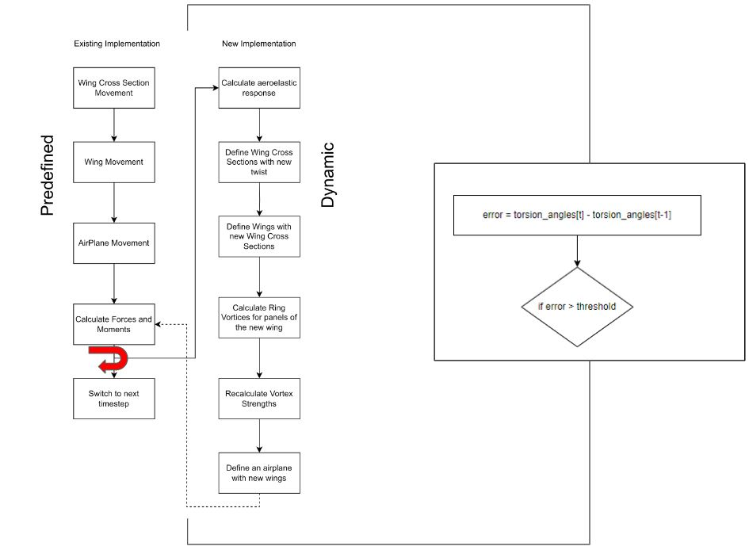

## Aeroelasticity Module

The aeroelasticity module acts as a feedback loop, enabling dynamic reconfiguration of "Wing twist" parameter 
for each defined cross-section of the wing. 
Wing twist (degrees) is equivalent to the incidence angle of the cross-section, defined about the leading edge. and is
only stable upto 45 degrees.
This module represents aeroelastic feedback as torsion about the leading edge.

Pictured below is the Aeroelastic Feedback loop 

Where,

### Functions
#### [calculate_aeroelastic_response](https://github.com/MOLOCH-dev/PteraSoftware/blob/446b18ebc34f91f703c73361e0fc57323cd0b612/pterasoftware/unsteady_ring_vortex_lattice_method.py#L1815)
This function :
- Obtains current aerodynamic forces from PteraSoftware's U.V.L.M. solver

- Obtains linear acceleration along panel normal of every panel's collocation point

- Obtains inertial force on every collocation point

- Runs convergence loop to obtain torsion angle of each cross-section due to aerodynamic and inertial forces

- Redefines wing for current timestep ([function : create_new_wing()](https://github.com/MOLOCH-dev/PteraSoftware/blob/446b18ebc34f91f703c73361e0fc57323cd0b612/pterasoftware/unsteady_ring_vortex_lattice_method.py#L1953))

### Overall code flow
